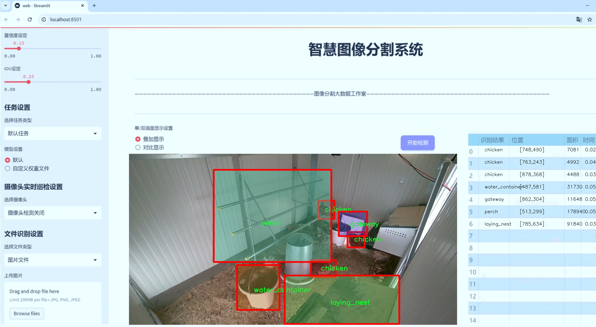
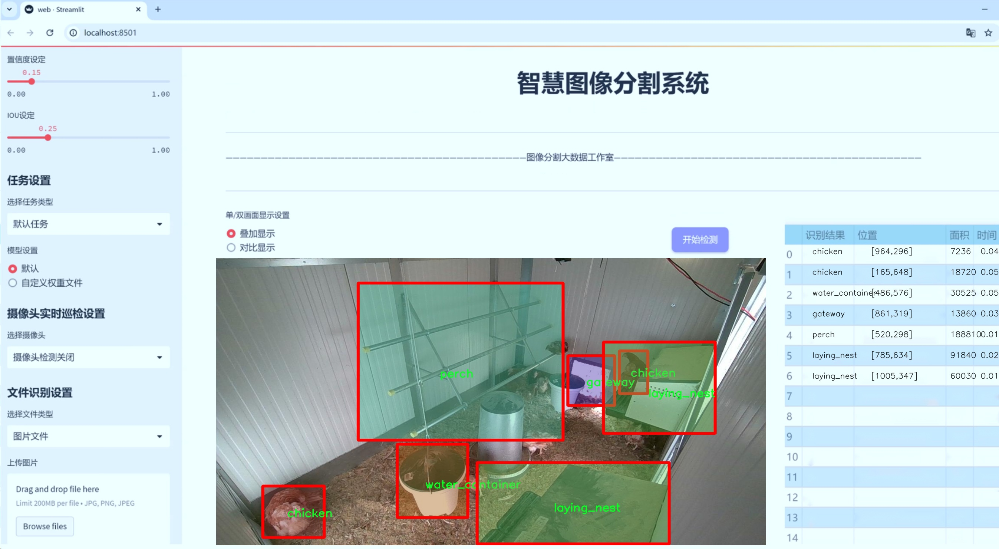
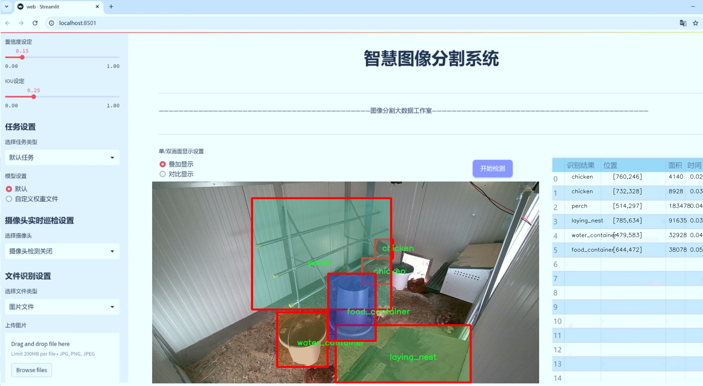
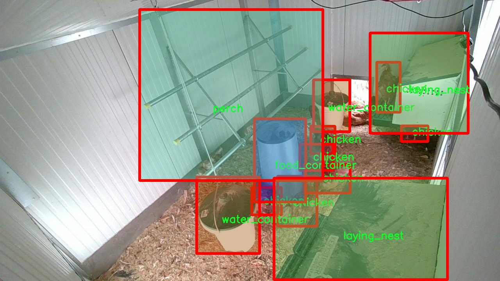
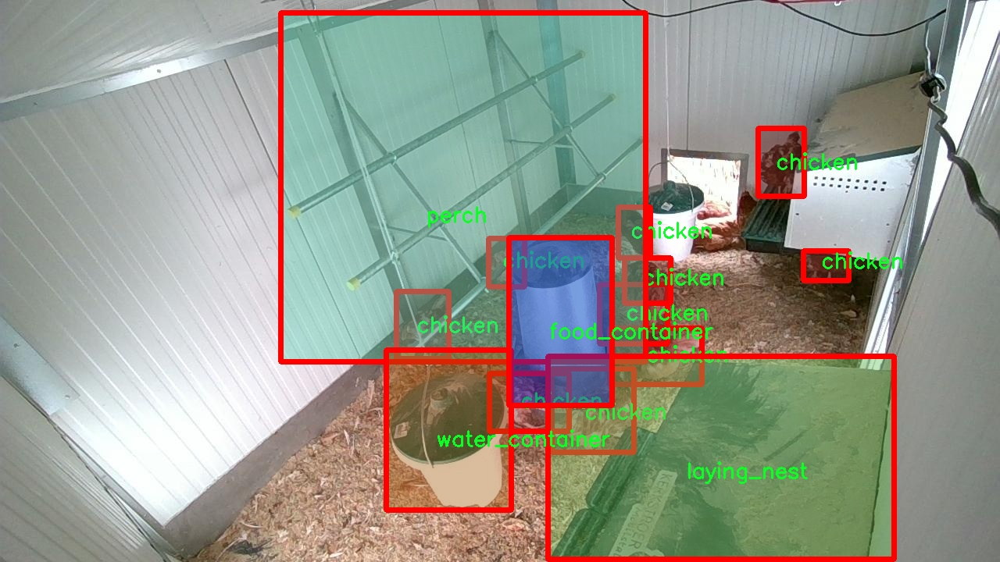
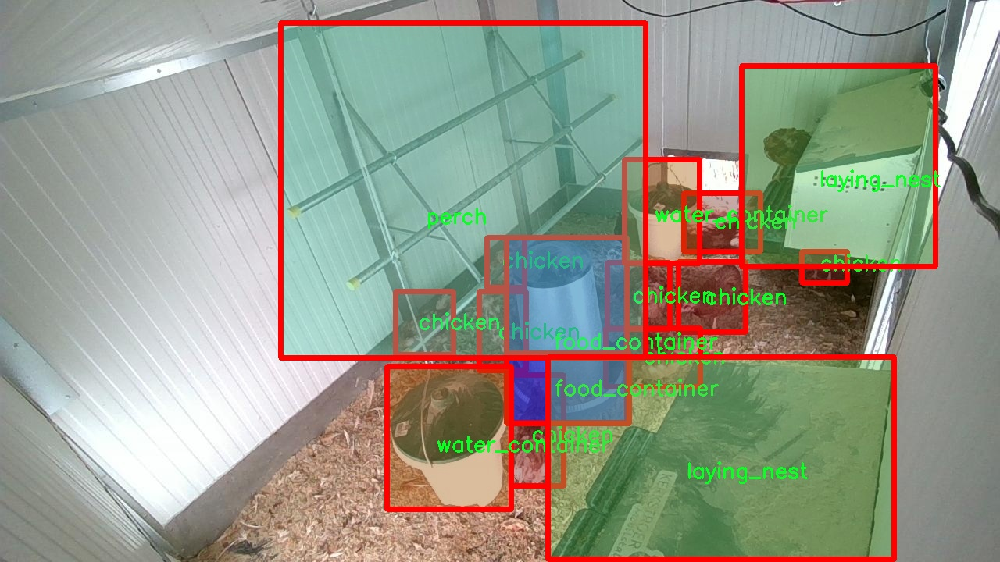
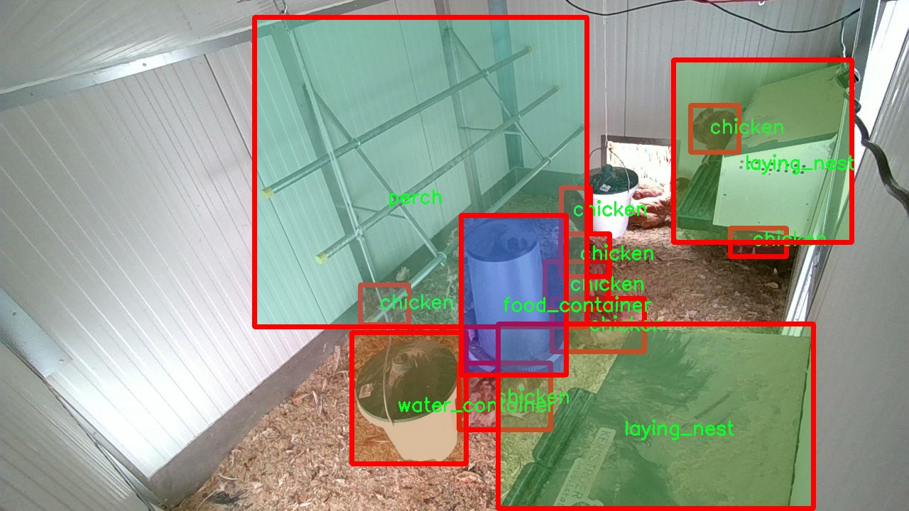

# 鸡只与养殖场环境物品图像分割系统： yolov8-seg

### 1.研究背景与意义

[参考博客](https://gitee.com/YOLOv8_YOLOv11_Segmentation_Studio/projects)

[博客来源](https://kdocs.cn/l/cszuIiCKVNis)

研究背景与意义

随着全球对高效、可持续农业生产的需求日益增加，家禽养殖业在满足人类食品需求方面扮演着重要角色。尤其是鸡只养殖，因其生长周期短、饲养成本低而受到广泛关注。然而，传统的鸡只养殖管理方式往往依赖人工监测，效率低下且容易受到人为因素的影响，导致资源浪费和生产效率低下。因此，如何通过先进的技术手段提升鸡只养殖的管理水平，成为了当前农业科技研究的重要课题。

近年来，计算机视觉技术的迅猛发展为农业领域带来了新的机遇。特别是基于深度学习的图像分割技术，能够有效地识别和分离图像中的不同对象，为智能养殖提供了重要的技术支持。YOLO（You Only Look Once）系列模型因其高效的实时目标检测能力而受到广泛应用，YOLOv8作为该系列的最新版本，进一步提升了检测精度和速度。基于YOLOv8的图像分割系统，能够在复杂的养殖环境中，准确识别鸡只及其周围环境中的各种物品，为养殖管理提供了可靠的数据支持。

本研究旨在构建一个基于改进YOLOv8的鸡只与养殖场环境物品图像分割系统，利用丰富的数据集进行训练和测试。该数据集包含8700张图像，涵盖了六个类别：鸡只、饲料容器、出入口、产卵巢、栖木和水容器。这些类别不仅包括了鸡只本身，还涵盖了养殖过程中必不可少的环境物品，能够全面反映养殖场的实际情况。通过对这些图像的分析与处理，系统能够实现对鸡只及其周围环境的精准识别和分割，为后续的智能化管理提供基础。

该研究的意义在于，首先，通过实现鸡只与养殖环境物品的高效分割，能够为养殖场提供实时监测与管理的能力，帮助养殖者及时发现潜在问题，如饲料不足、水源缺乏等，从而提高养殖效率和动物福利。其次，系统的建立将为相关领域的研究提供数据支持和技术参考，推动计算机视觉技术在农业中的应用发展。此外，随着数据集的不断丰富和模型的持续优化，未来该系统还可以扩展到其他家禽或养殖动物的管理中，具有广泛的应用前景。

综上所述，基于改进YOLOv8的鸡只与养殖场环境物品图像分割系统，不仅具有重要的学术价值，也为实际养殖管理提供了切实可行的解决方案。通过本研究的开展，期望能够为智能农业的发展贡献一份力量，推动家禽养殖业向更高效、可持续的方向迈进。

### 2.图片演示







注意：本项目提供完整的训练源码数据集和训练教程,由于此博客编辑较早,暂不提供权重文件（best.pt）,需要按照6.训练教程进行训练后实现上图效果。

### 3.视频演示

[3.1 视频演示](https://www.bilibili.com/video/BV1WyByYPEVi/)

### 4.数据集信息

##### 4.1 数据集类别数＆类别名

nc: 6
names: ['chicken', 'food_container', 'gateway', 'laying_nest', 'perch', 'water_container']


##### 4.2 数据集信息简介

数据集信息展示

在本研究中，我们使用了名为“chicken_2_groundDINO_6labels_bb”的数据集，旨在改进YOLOv8-seg模型，以实现对鸡只及其养殖场环境物品的高效图像分割。该数据集专门设计用于训练深度学习模型，提供了丰富的标注信息，涵盖了六个主要类别，分别是“chicken”（鸡只）、“food_container”（饲料容器）、“gateway”（通道）、“laying_nest”（产卵巢）、“perch”（栖木）和“water_container”（水容器）。这些类别不仅代表了养殖场中常见的物品和动物，还为模型的训练提供了多样化的视觉信息，有助于提高其在实际应用中的识别和分割能力。

数据集的构建过程充分考虑了养殖场的实际环境，确保了图像的多样性和代表性。每个类别的图像均来自于不同的养殖场，涵盖了不同的光照条件、角度和背景。这种多样性使得模型在训练过程中能够学习到更加丰富的特征，从而提高其在不同环境下的泛化能力。例如，鸡只的图像不仅包括在笼子内的状态，还包括在开放空间中的活动场景，这样的设计使得模型能够更好地适应实际养殖场的复杂情况。

在数据集的标注方面，采用了高精度的边界框和分割掩码，使得每个类别的物体都得到了准确的定位和分割。这种精细的标注方式为YOLOv8-seg模型的训练提供了可靠的基础，确保了模型能够有效地识别和分割出每个类别的物体。尤其是在处理鸡只与环境物品的重叠区域时，精确的分割信息能够显著提高模型的性能，减少误检和漏检的情况。

此外，数据集还包含了丰富的背景信息，这对于训练模型理解不同物体之间的关系至关重要。例如，饲料容器和水容器通常位于鸡只活动的区域，而产卵巢和栖木则是鸡只栖息和产卵的重要场所。通过学习这些物体之间的空间关系，模型不仅能够识别单个物体，还能够理解它们在养殖场中的功能和作用，从而实现更为智能的图像分割。

在训练过程中，我们将数据集划分为训练集和验证集，以确保模型的训练效果和评估的准确性。通过不断调整模型参数和优化算法，我们期望能够提升YOLOv8-seg在鸡只及养殖场环境物品图像分割任务中的表现。最终，经过多轮的训练和验证，我们希望能够实现一个高效、准确的图像分割系统，为养殖业的智能化管理提供有力支持。

综上所述，“chicken_2_groundDINO_6labels_bb”数据集不仅为本研究提供了丰富的训练素材，也为改进YOLOv8-seg模型的性能奠定了坚实的基础。通过对鸡只及其养殖环境物品的深入分析和研究，我们期望能够推动养殖业的数字化转型，提升其生产效率和管理水平。










### 5.项目依赖环境部署教程（零基础手把手教学）

[5.1 环境部署教程链接（零基础手把手教学）](https://www.bilibili.com/video/BV1jG4Ve4E9t/?vd_source=bc9aec86d164b67a7004b996143742dc)


[5.2 安装Python虚拟环境创建和依赖库安装视频教程链接（零基础手把手教学）](https://www.bilibili.com/video/BV1nA4VeYEze/?vd_source=bc9aec86d164b67a7004b996143742dc)

### 6.手把手YOLOV8-seg训练视频教程（零基础手把手教学）

[6.1 手把手YOLOV8-seg训练视频教程（零基础小白有手就能学会）](https://www.bilibili.com/video/BV1cA4VeYETe/?vd_source=bc9aec86d164b67a7004b996143742dc)


按照上面的训练视频教程链接加载项目提供的数据集，运行train.py即可开始训练



     Epoch   gpu_mem       box       obj       cls    labels  img_size
     1/200     0G   0.01576   0.01955  0.007536        22      1280: 100%|██████████| 849/849 [14:42<00:00,  1.04s/it]
               Class     Images     Labels          P          R     mAP@.5 mAP@.5:.95: 100%|██████████| 213/213 [01:14<00:00,  2.87it/s]
                 all       3395      17314      0.994      0.957      0.0957      0.0843

     Epoch   gpu_mem       box       obj       cls    labels  img_size
     2/200     0G   0.01578   0.01923  0.007006        22      1280: 100%|██████████| 849/849 [14:44<00:00,  1.04s/it]
               Class     Images     Labels          P          R     mAP@.5 mAP@.5:.95: 100%|██████████| 213/213 [01:12<00:00,  2.95it/s]
                 all       3395      17314      0.996      0.956      0.0957      0.0845

     Epoch   gpu_mem       box       obj       cls    labels  img_size
     3/200     0G   0.01561    0.0191  0.006895        27      1280: 100%|██████████| 849/849 [10:56<00:00,  1.29it/s]
               Class     Images     Labels          P          R     mAP@.5 mAP@.5:.95: 100%|███████   | 187/213 [00:52<00:00,  4.04it/s]
                 all       3395      17314      0.996      0.957      0.0957      0.0845


### 7.50+种全套YOLOV8-seg创新点加载调参实验视频教程（一键加载写好的改进模型的配置文件）

[7.1 50+种全套YOLOV8-seg创新点加载调参实验视频教程（一键加载写好的改进模型的配置文件）](https://www.bilibili.com/video/BV1Hw4VePEXv/?vd_source=bc9aec86d164b67a7004b996143742dc)

### YOLOV8-seg算法简介

原始YOLOV8-seg算法原理

YOLOv8-seg算法是2023年由Ultralytics公司推出的YOLO系列最新版本，标志着目标检测和图像分割领域的一次重要进步。作为YOLO系列的第八个版本，YOLOv8不仅继承了前几代算法的优点，还在结构设计、性能优化和训练策略上进行了诸多创新，尤其是在处理图像分割任务时展现出更为出色的能力。

YOLOv8-seg的核心架构由三个主要部分组成：Backbone（骨干网络）、Neck（颈部结构）和Head（头部结构）。在Backbone部分，YOLOv8采用了CSP（Cross Stage Partial）结构，进一步优化了特征提取的效率。CSP结构通过将特征提取过程分为两部分，分别进行卷积和连接，能够有效减轻模型的计算负担，并提高特征的表达能力。在YOLOv8中，C3模块被C2f模块所替代，C2f模块引入了更多的分支，丰富了梯度回传的路径，使得网络在训练过程中能够更好地捕捉到多样化的特征信息。

在Neck部分，YOLOv8-seg继续采用FPN（Feature Pyramid Network）和PAN（Path Aggregation Network）相结合的结构，以实现多尺度特征的融合。FPN的设计理念是通过构建特征金字塔，使得不同尺度的特征能够有效结合，从而提升模型对小物体的检测能力。而PAN则通过对特征进行自底向上的传递，进一步增强了高层特征与低层特征之间的联系，确保了信息的充分流动。这种结构的结合使得YOLOv8-seg在处理复杂场景时，能够更好地应对物体尺度变化和遮挡问题。

YOLOv8-seg在Head部分采用了解耦头（Decoupled Head）结构，这一设计的灵感来源于YOLOX的创新。解耦头将分类和定位任务分开处理，通过并行的分支分别提取类别特征和位置特征，最后通过1×1卷积层完成分类和定位的输出。这种结构的优势在于能够更灵活地处理不同类型的任务，提高了模型的整体性能。在YOLOv8-seg中，解耦头的设计不仅提升了目标检测的精度，还为图像分割任务提供了更为细致的特征表达。

在损失函数的设计上，YOLOv8-seg引入了Varifocal Loss（VFL）和CIoU Loss（Complete Intersection over Union Loss），这两种损失函数的结合使得模型在训练过程中能够更好地关注高质量的正样本，并有效降低负样本对损失的影响。VFL通过对正负样本进行不对称加权，确保了模型在训练时能够更好地聚焦于那些具有高IoU（Intersection over Union）值的样本，从而提升了检测精度。CIoU Loss则通过考虑中心点距离、宽高比和重叠区域等多个因素，使得回归损失更加全面和准确。

YOLOv8-seg在数据预处理方面也延续了YOLOv5的策略，采用了多种数据增强手段，如马赛克增强、混合增强、空间扰动和颜色扰动等。这些增强技术的引入，不仅丰富了训练数据的多样性，还有效提升了模型的鲁棒性，使其在面对不同场景和光照条件时，依然能够保持良好的性能。

此外，YOLOv8-seg在标签分配策略上进行了创新，采用了TOOD（Task-Oriented Object Detection）策略。这一动态标签分配方法能够根据目标的特征动态调整正负样本的匹配，避免了传统方法中因数据集不充分而导致的候选框不准确问题。通过这种策略，YOLOv8-seg能够更好地适应不同的数据集，提升了模型的泛化能力。

在实际应用中，YOLOv8-seg展现出了极高的推理速度和准确性，成为了目标检测和图像分割领域的一个重要工具。其原生支持自定义数据集的特性，使得研究人员和开发者能够更方便地将其应用于特定任务，进一步推动了相关领域的研究与应用。

综上所述，YOLOv8-seg算法通过在骨干网络、特征融合、解耦头结构、损失函数和标签分配策略等多个方面的创新，极大地提升了目标检测和图像分割的性能。其灵活的架构设计和高效的训练策略，使得YOLOv8-seg不仅在学术研究中具有重要意义，也在工业应用中展现出广泛的前景。随着YOLOv8-seg的不断发展和完善，未来在计算机视觉领域的应用将更加广泛，推动着智能视觉技术的进步。


### 9.系统功能展示（检测对象为举例，实际内容以本项目数据集为准）

图9.1.系统支持检测结果表格显示

  图9.2.系统支持置信度和IOU阈值手动调节

  图9.3.系统支持自定义加载权重文件best.pt(需要你通过步骤5中训练获得)

  图9.4.系统支持摄像头实时识别

  图9.5.系统支持图片识别

  图9.6.系统支持视频识别

  图9.7.系统支持识别结果文件自动保存

  图9.8.系统支持Excel导出检测结果数据


### 10.50+种全套YOLOV8-seg创新点原理讲解（非科班也可以轻松写刊发刊，V11版本正在科研待更新）

#### 10.1 由于篇幅限制，每个创新点的具体原理讲解就不一一展开，具体见下列网址中的创新点对应子项目的技术原理博客网址【Blog】：


[10.1 50+种全套YOLOV8-seg创新点原理讲解链接](https://gitee.com/qunmasj/good)

#### 10.2 部分改进模块原理讲解(完整的改进原理见上图和技术博客链接)【如果此小节的图加载失败可以通过CSDN或者Github搜索该博客的标题访问原始博客，原始博客图片显示正常】

### YOLOv8简介
#### Backbone
Darknet-53
53指的是“52层卷积”+output layer。

借鉴了其他算法的这些设计思想

借鉴了VGG的思想，使用了较多的3×3卷积，在每一次池化操作后，将通道数翻倍；

借鉴了network in network的思想，使用全局平均池化（global average pooling）做预测，并把1×1的卷积核置于3×3的卷积核之间，用来压缩特征；（我没找到这一步体现在哪里）


使用了批归一化层稳定模型训练，加速收敛，并且起到正则化作用。

    以上三点为Darknet19借鉴其他模型的点。Darknet53当然是在继承了Darknet19的这些优点的基础上再新增了下面这些优点的。因此列在了这里

借鉴了ResNet的思想，在网络中大量使用了残差连接，因此网络结构可以设计的很深，并且缓解了训练中梯度消失的问题，使得模型更容易收敛。

使用步长为2的卷积层代替池化层实现降采样。（这一点在经典的Darknet-53上是很明显的，output的长和宽从256降到128，再降低到64，一路降低到8，应该是通过步长为2的卷积层实现的；在YOLOv8的卷积层中也有体现，比如图中我标出的这些位置）

#### 特征融合

模型架构图如下

  Darknet-53的特点可以这样概括：（Conv卷积模块+Residual Block残差块）串行叠加4次

  Conv卷积层+Residual Block残差网络就被称为一个stage


上面红色指出的那个，原始的Darknet-53里面有一层 卷积，在YOLOv8里面，把一层卷积移除了

为什么移除呢？

        原始Darknet-53模型中间加的这个卷积层做了什么？滤波器（卷积核）的个数从 上一个卷积层的512个，先增加到1024个卷积核，然后下一层卷积的卷积核的个数又降低到512个

        移除掉这一层以后，少了1024个卷积核，就可以少做1024次卷积运算，同时也少了1024个3×3的卷积核的参数，也就是少了9×1024个参数需要拟合。这样可以大大减少了模型的参数，（相当于做了轻量化吧）

        移除掉这个卷积层，可能是因为作者发现移除掉这个卷积层以后，模型的score有所提升，所以才移除掉的。为什么移除掉以后，分数有所提高呢？可能是因为多了这些参数就容易，参数过多导致模型在训练集删过拟合，但是在测试集上表现很差，最终模型的分数比较低。你移除掉这个卷积层以后，参数减少了，过拟合现象不那么严重了，泛化能力增强了。当然这个是，拿着你做实验的结论，反过来再找补，再去强行解释这种现象的合理性。


通过MMdetection官方绘制册这个图我们可以看到，进来的这张图片经过一个“Feature Pyramid Network(简称FPN)”，然后最后的P3、P4、P5传递给下一层的Neck和Head去做识别任务。 PAN（Path Aggregation Network）


“FPN是自顶向下，将高层的强语义特征传递下来。PAN就是在FPN的后面添加一个自底向上的金字塔，对FPN补充，将低层的强定位特征传递上去，

FPN是自顶（小尺寸，卷积次数多得到的结果，语义信息丰富）向下（大尺寸，卷积次数少得到的结果），将高层的强语义特征传递下来，对整个金字塔进行增强，不过只增强了语义信息，对定位信息没有传递。PAN就是针对这一点，在FPN的后面添加一个自底（卷积次数少，大尺寸）向上（卷积次数多，小尺寸，语义信息丰富）的金字塔，对FPN补充，将低层的强定位特征传递上去，又被称之为“双塔战术”。

FPN层自顶向下传达强语义特征，而特征金字塔则自底向上传达强定位特征，两两联手，从不同的主干层对不同的检测层进行参数聚合,这样的操作确实很皮。
#### 自底向上增强


而 PAN（Path Aggregation Network）是对 FPN 的一种改进，它的设计理念是在 FPN 后面添加一个自底向上的金字塔。PAN 引入了路径聚合的方式，通过将浅层特征图（低分辨率但语义信息较弱）和深层特征图（高分辨率但语义信息丰富）进行聚合，并沿着特定的路径传递特征信息，将低层的强定位特征传递上去。这样的操作能够进一步增强多尺度特征的表达能力，使得 PAN 在目标检测任务中表现更加优秀。


### Gold-YOLO简介
YOLO系列模型面世至今已有8年，由于其优异的性能，已成为目标检测领域的标杆。在系列模型经过十多个不同版本的改进发展逐渐稳定完善的今天，研究人员更多关注于单个计算模块内结构的精细调整，或是head部分和训练方法上的改进。但这并不意味着现有模式已是最优解。

当前YOLO系列模型通常采用类FPN方法进行信息融合，而这一结构在融合跨层信息时存在信息损失的问题。针对这一问题，我们提出了全新的信息聚集-分发（Gather-and-Distribute Mechanism）GD机制，通过在全局视野上对不同层级的特征进行统一的聚集融合并分发注入到不同层级中，构建更加充分高效的信息交互融合机制，并基于GD机制构建了Gold-YOLO。在COCO数据集中，我们的Gold-YOLO超越了现有的YOLO系列，实现了精度-速度曲线上的SOTA。


精度和速度曲线（TensorRT7）


精度和速度曲线（TensorRT8）
传统YOLO的问题
在检测模型中，通常先经过backbone提取得到一系列不同层级的特征，FPN利用了backbone的这一特点，构建了相应的融合结构：不层级的特征包含着不同大小物体的位置信息，虽然这些特征包含的信息不同，但这些特征在相互融合后能够互相弥补彼此缺失的信息，增强每一层级信息的丰富程度，提升网络性能。

原始的FPN结构由于其层层递进的信息融合模式，使得相邻层的信息能够充分融合，但也导致了跨层信息融合存在问题：当跨层的信息进行交互融合时，由于没有直连的交互通路，只能依靠中间层充当“中介”进行融合，导致了一定的信息损失。之前的许多工作中都关注到了这一问题，而解决方案通常是通过添加shortcut增加更多的路径，以增强信息流动。

然而传统的FPN结构即便改进后，由于网络中路径过多，且交互方式不直接，基于FPN思想的信息融合结构仍然存在跨层信息交互困难和信息损失的问题。

#### Gold-YOLO：全新的信息融合交互机制


#### Gold-YOLO架构
参考该博客提出的一种全新的信息交互融合机制：信息聚集-分发机制(Gather-and-Distribute Mechanism)。该机制通过在全局上融合不同层次的特征得到全局信息，并将全局信息注入到不同层级的特征中，实现了高效的信息交互和融合。在不显著增加延迟的情况下GD机制显著增强了Neck部分的信息融合能力，提高了模型对不同大小物体的检测能力。

GD机制通过三个模块实现：信息对齐模块(FAM)、信息融合模块(IFM)和信息注入模块(Inject)。

信息对齐模块负责收集并对齐不同层级不同大小的特征

信息融合模块通过使用卷积或Transformer算子对对齐后的的特征进行融合，得到全局信息

信息注入模块将全局信息注入到不同层级中

在Gold-YOLO中，针对模型需要检测不同大小的物体的需要，并权衡精度和速度，我们构建了两个GD分支对信息进行融合：低层级信息聚集-分发分支(Low-GD)和高层级信息聚集-分发分支(High-GD)，分别基于卷积和transformer提取和融合特征信息。

此外,为了促进局部信息的流动，我们借鉴现有工作，构建了一个轻量级的邻接层融合模块，该模块在局部尺度上结合了邻近层的特征，进一步提升了模型性能。我们还引入并验证了预训练方法对YOLO模型的有效性，通过在ImageNet 1K上使用MAE方法对主干进行预训练，显著提高了模型的收敛速度和精度。


### 11.项目核心源码讲解（再也不用担心看不懂代码逻辑）

#### 11.1 ultralytics\utils\callbacks\wb.py

以下是经过简化和注释的核心代码部分，保留了最重要的功能，并对每个函数进行了详细的中文注释：

```python
# 导入必要的库
from ultralytics.utils import SETTINGS, TESTS_RUNNING
from ultralytics.utils.torch_utils import model_info_for_loggers

try:
    # 确保不是在测试运行中
    assert not TESTS_RUNNING  
    # 确保WandB集成已启用
    assert SETTINGS['wandb'] is True  
    import wandb as wb

    # 确保WandB包被正确导入
    assert hasattr(wb, '__version__')  

    import numpy as np
    import pandas as pd

    _processed_plots = {}  # 用于记录已处理的图表

except (ImportError, AssertionError):
    wb = None  # 如果导入失败，则将wb设置为None


def _custom_table(x, y, classes, title='Precision Recall Curve', x_title='Recall', y_title='Precision'):
    """
    创建并记录自定义的精确度-召回率曲线可视化。

    Args:
        x (List): x轴的值，长度为N。
        y (List): y轴的值，长度为N。
        classes (List): 每个点的类别标签，长度为N。
        title (str, optional): 图表标题，默认为'Precision Recall Curve'。
        x_title (str, optional): x轴标签，默认为'Recall'。
        y_title (str, optional): y轴标签，默认为'Precision'。

    Returns:
        (wandb.Object): 适合记录的wandb对象，展示自定义的度量可视化。
    """
    df = pd.DataFrame({'class': classes, 'y': y, 'x': x}).round(3)  # 创建数据框
    fields = {'x': 'x', 'y': 'y', 'class': 'class'}
    string_fields = {'title': title, 'x-axis-title': x_title, 'y-axis-title': y_title}
    return wb.plot_table('wandb/area-under-curve/v0',
                         wb.Table(dataframe=df),
                         fields=fields,
                         string_fields=string_fields)


def _plot_curve(x, y, names=None, id='precision-recall', title='Precision Recall Curve', x_title='Recall', y_title='Precision', num_x=100, only_mean=False):
    """
    记录度量曲线可视化。

    Args:
        x (np.ndarray): x轴数据点，长度为N。
        y (np.ndarray): y轴数据点，形状为CxN，C为类别数。
        names (list, optional): 类别名称，长度为C。
        id (str, optional): 记录数据的唯一标识符，默认为'precision-recall'。
        title (str, optional): 可视化图表的标题，默认为'Precision Recall Curve'。
        x_title (str, optional): x轴标签，默认为'Recall'。
        y_title (str, optional): y轴标签，默认为'Precision'。
        num_x (int, optional): 可视化的插值数据点数量，默认为100。
        only_mean (bool, optional): 是否仅绘制均值曲线的标志，默认为True。
    """
    if names is None:
        names = []  # 如果没有提供类别名称，则初始化为空列表
    x_new = np.linspace(x[0], x[-1], num_x).round(5)  # 创建新的x值

    # 创建用于记录的数组
    x_log = x_new.tolist()
    y_log = np.interp(x_new, x, np.mean(y, axis=0)).round(3).tolist()  # 插值计算y值

    if only_mean:
        # 仅记录均值曲线
        table = wb.Table(data=list(zip(x_log, y_log)), columns=[x_title, y_title])
        wb.run.log({title: wb.plot.line(table, x_title, y_title, title=title)})
    else:
        # 记录每个类别的曲线
        classes = ['mean'] * len(x_log)
        for i, yi in enumerate(y):
            x_log.extend(x_new)  # 添加新的x值
            y_log.extend(np.interp(x_new, x, yi))  # 插值y值
            classes.extend([names[i]] * len(x_new))  # 添加类别名称
        wb.log({id: _custom_table(x_log, y_log, classes, title, x_title, y_title)}, commit=False)


def on_fit_epoch_end(trainer):
    """在每个训练周期结束时记录训练指标和模型信息。"""
    wb.run.log(trainer.metrics, step=trainer.epoch + 1)  # 记录当前周期的指标
    # 记录图表
    _log_plots(trainer.plots, step=trainer.epoch + 1)
    _log_plots(trainer.validator.plots, step=trainer.epoch + 1)
    if trainer.epoch == 0:
        wb.run.log(model_info_for_loggers(trainer), step=trainer.epoch + 1)  # 记录模型信息


def on_train_end(trainer):
    """在训练结束时保存最佳模型作为artifact。"""
    _log_plots(trainer.validator.plots, step=trainer.epoch + 1)
    _log_plots(trainer.plots, step=trainer.epoch + 1)
    art = wb.Artifact(type='model', name=f'run_{wb.run.id}_model')  # 创建模型artifact
    if trainer.best.exists():
        art.add_file(trainer.best)  # 添加最佳模型文件
        wb.run.log_artifact(art, aliases=['best'])  # 记录artifact
    # 记录验证指标曲线
    for curve_name, curve_values in zip(trainer.validator.metrics.curves, trainer.validator.metrics.curves_results):
        x, y, x_title, y_title = curve_values
        _plot_curve(
            x,
            y,
            names=list(trainer.validator.metrics.names.values()),
            id=f'curves/{curve_name}',
            title=curve_name,
            x_title=x_title,
            y_title=y_title,
        )
    wb.run.finish()  # 结束WandB运行


# 定义回调函数
callbacks = {
    'on_fit_epoch_end': on_fit_epoch_end,
    'on_train_end': on_train_end
} if wb else {}
```

### 代码核心部分说明：
1. **WandB集成**：代码首先检查WandB是否可用，并确保在训练期间不进行测试。
2. **自定义表格**：`_custom_table`函数用于创建精确度-召回率曲线的可视化，并将其记录到WandB。
3. **绘制曲线**：`_plot_curve`函数根据输入数据生成曲线，并记录到WandB，可以选择仅记录均值曲线或所有类别的曲线。
4. **训练过程回调**：`on_fit_epoch_end`和`on_train_end`函数分别在每个训练周期结束时记录指标和在训练结束时保存最佳模型。

这些核心部分确保了模型训练过程中的指标和可视化结果能够被有效记录和管理。

这个文件是Ultralytics YOLO项目中的一个回调模块，主要用于与Weights & Biases（wandb）进行集成，以便在训练过程中记录和可视化模型的性能指标。文件中首先导入了一些必要的模块，并进行了一些基本的检查，以确保wandb库可用并且当前不是在运行测试。

在文件中定义了几个函数。首先是`_custom_table`函数，它用于创建和记录一个自定义的精确度-召回曲线的可视化图表。该函数接收x轴和y轴的数据、类别标签以及图表的标题等参数，使用Pandas库将数据整理成表格格式，并通过wandb的API生成可视化图表。

接下来是`_plot_curve`函数，它用于记录一个指标曲线的可视化。这个函数可以根据输入的数据生成精确度-召回曲线，并支持绘制所有类别的曲线或仅绘制平均曲线。它会生成新的x值并通过插值计算相应的y值，然后将这些数据记录到wandb中。

`_log_plots`函数用于记录输入字典中的图表，如果这些图表在指定的步骤中尚未记录过。它会检查每个图表的时间戳，以避免重复记录。

接下来的几个函数是与训练过程的不同阶段相关的回调函数。`on_pretrain_routine_start`函数在预训练例程开始时调用，初始化wandb的运行。`on_fit_epoch_end`函数在每个训练周期结束时记录训练指标和模型信息。`on_train_epoch_end`函数在每个训练周期结束时记录标签损失和学习率，并在特定条件下记录图表。`on_train_end`函数在训练结束时保存最佳模型，并记录验证器的图表和曲线。

最后，文件定义了一个回调字典，包含了上述回调函数的映射，仅在wandb可用时才会创建这个字典。整体来看，这个文件的主要功能是通过wandb记录和可视化模型训练过程中的各种指标，帮助开发者更好地监控和分析模型的性能。

#### 11.2 ultralytics\utils\callbacks\clearml.py

以下是经过简化并添加详细中文注释的核心代码部分：

```python
# 导入必要的库
from ultralytics.utils import LOGGER, SETTINGS, TESTS_RUNNING

# 尝试导入 ClearML 库并进行基本的设置检查
try:
    assert not TESTS_RUNNING  # 确保不是在运行测试
    assert SETTINGS['clearml'] is True  # 确保 ClearML 集成已启用
    import clearml
    from clearml import Task
    from clearml.binding.frameworks.pytorch_bind import PatchPyTorchModelIO
    from clearml.binding.matplotlib_bind import PatchedMatplotlib

    assert hasattr(clearml, '__version__')  # 确保 ClearML 包不是目录

except (ImportError, AssertionError):
    clearml = None  # 如果导入失败，则将 clearml 设置为 None


def _log_debug_samples(files, title='Debug Samples') -> None:
    """
    将文件（图像）作为调试样本记录到 ClearML 任务中。

    参数:
        files (list): 文件路径列表，格式为 PosixPath。
        title (str): 将具有相同值的图像分组的标题。
    """
    import re

    task = Task.current_task()  # 获取当前任务
    if task:
        for f in files:
            if f.exists():  # 检查文件是否存在
                it = re.search(r'_batch(\d+)', f.name)  # 提取批次号
                iteration = int(it.groups()[0]) if it else 0  # 获取迭代次数
                task.get_logger().report_image(title=title,
                                               series=f.name.replace(it.group(), ''),
                                               local_path=str(f),
                                               iteration=iteration)  # 记录图像


def on_pretrain_routine_start(trainer):
    """在预训练例程开始时运行；初始化并连接/记录任务到 ClearML。"""
    try:
        task = Task.current_task()  # 获取当前任务
        if task:
            # 确保自动的 PyTorch 和 Matplotlib 绑定被禁用
            PatchPyTorchModelIO.update_current_task(None)
            PatchedMatplotlib.update_current_task(None)
        else:
            # 初始化新的 ClearML 任务
            task = Task.init(project_name=trainer.args.project or 'YOLOv8',
                             task_name=trainer.args.name,
                             tags=['YOLOv8'],
                             output_uri=True,
                             reuse_last_task_id=False,
                             auto_connect_frameworks={
                                 'pytorch': False,
                                 'matplotlib': False})
            LOGGER.warning('ClearML 初始化了一个新任务。如果您想远程运行，请在初始化 YOLO 之前添加 clearml-init 并连接您的参数。')
        task.connect(vars(trainer.args), name='General')  # 连接训练参数
    except Exception as e:
        LOGGER.warning(f'警告 ⚠️ ClearML 已安装但未正确初始化，未记录此运行。{e}')


def on_train_epoch_end(trainer):
    """在 YOLO 训练的每个 epoch 结束时记录调试样本并报告当前训练进度。"""
    task = Task.current_task()  # 获取当前任务
    if task:
        # 记录调试样本
        if trainer.epoch == 1:
            _log_debug_samples(sorted(trainer.save_dir.glob('train_batch*.jpg')), 'Mosaic')  # 记录训练批次图像
        # 报告当前训练进度
        for k, v in trainer.validator.metrics.results_dict.items():
            task.get_logger().report_scalar('train', k, v, iteration=trainer.epoch)  # 记录训练指标


def on_train_end(trainer):
    """在训练完成时记录最终模型及其名称。"""
    task = Task.current_task()  # 获取当前任务
    if task:
        # 记录最终结果，混淆矩阵 + PR 图
        files = [
            'results.png', 'confusion_matrix.png', 'confusion_matrix_normalized.png',
            *(f'{x}_curve.png' for x in ('F1', 'PR', 'P', 'R'))]
        files = [(trainer.save_dir / f) for f in files if (trainer.save_dir / f).exists()]  # 过滤存在的文件
        for f in files:
            _log_plot(title=f.stem, plot_path=f)  # 记录图像
        # 报告最终指标
        for k, v in trainer.validator.metrics.results_dict.items():
            task.get_logger().report_single_value(k, v)  # 记录最终指标
        # 记录最终模型
        task.update_output_model(model_path=str(trainer.best), model_name=trainer.args.name, auto_delete_file=False)  # 更新模型

# 定义回调函数
callbacks = {
    'on_pretrain_routine_start': on_pretrain_routine_start,
    'on_train_epoch_end': on_train_epoch_end,
    'on_train_end': on_train_end} if clearml else {}
```

### 代码核心部分说明：
1. **ClearML 集成**：代码首先尝试导入 ClearML 并进行基本的配置检查，以确保集成正确。
2. **记录调试样本**：`_log_debug_samples` 函数用于将训练过程中的图像记录到 ClearML 中，便于后续分析。
3. **任务初始化**：`on_pretrain_routine_start` 函数在预训练开始时初始化 ClearML 任务，并连接训练参数。
4. **训练过程记录**：`on_train_epoch_end` 和 `on_train_end` 函数分别在每个训练 epoch 结束时记录调试样本和最终模型结果。

这个程序文件 `clearml.py` 是一个用于与 ClearML 集成的回调模块，主要用于在训练 YOLO 模型时记录和管理实验的日志。文件的开头部分导入了一些必要的库和模块，并进行了一些基本的检查，以确保 ClearML 的集成已启用并且没有在测试环境中运行。

在导入 ClearML 相关模块后，定义了一些辅助函数，例如 `_log_debug_samples` 和 `_log_plot`。前者用于将图像文件记录为调试样本，后者则用于将图像作为绘图记录到 ClearML 的绘图部分。这些函数的参数包括文件路径和标题等，确保在记录时能够清晰地标识出每个图像的来源和含义。

接下来的几个函数是与训练过程的不同阶段相关的回调函数。例如，`on_pretrain_routine_start` 在预训练例程开始时运行，负责初始化和连接 ClearML 任务，并禁用自动的 PyTorch 和 Matplotlib 绑定，以便手动记录这些内容。`on_train_epoch_end` 在每个训练周期结束时被调用，记录调试样本并报告当前的训练进度。`on_fit_epoch_end` 则在每个周期结束时报告模型信息。

`on_val_end` 函数用于在验证结束时记录验证结果，包括标签和预测。最后，`on_train_end` 在训练完成时被调用，记录最终模型及其名称，并报告最终的评估指标和混淆矩阵等结果。

整个文件的最后部分定义了一个回调字典，包含了上述所有回调函数，如果 ClearML 集成未启用，则该字典为空。这个模块的设计使得在使用 YOLO 进行训练时，可以方便地将训练过程中的重要信息记录到 ClearML 平台，便于后续的分析和可视化。

#### 11.3 ultralytics\nn\extra_modules\attention.py

以下是经过简化和注释的核心代码部分，主要保留了 `EMA`、`SimAM`、`SpatialGroupEnhance` 和 `BiLevelRoutingAttention` 类，并对每个类的功能进行了详细的中文注释。

```python
import torch
from torch import nn

class EMA(nn.Module):
    """
    Exponential Moving Average (EMA) 模块
    用于增强特征图的表示，利用组归一化和卷积操作。
    """
    def __init__(self, channels, factor=8):
        super(EMA, self).__init__()
        self.groups = factor  # 将通道分为多个组
        assert channels // self.groups > 0  # 确保每组至少有一个通道
        self.softmax = nn.Softmax(-1)  # 用于计算权重的 softmax
        self.agp = nn.AdaptiveAvgPool2d((1, 1))  # 自适应平均池化
        self.pool_h = nn.AdaptiveAvgPool2d((None, 1))  # 针对高度的池化
        self.pool_w = nn.AdaptiveAvgPool2d((1, None))  # 针对宽度的池化
        self.gn = nn.GroupNorm(channels // self.groups, channels // self.groups)  # 组归一化
        self.conv1x1 = nn.Conv2d(channels // self.groups, channels // self.groups, kernel_size=1)  # 1x1卷积
        self.conv3x3 = nn.Conv2d(channels // self.groups, channels // self.groups, kernel_size=3, padding=1)  # 3x3卷积

    def forward(self, x):
        b, c, h, w = x.size()  # 获取输入的批量大小、通道数、高度和宽度
        group_x = x.reshape(b * self.groups, -1, h, w)  # 将输入重塑为多个组
        x_h = self.pool_h(group_x)  # 对每组进行高度池化
        x_w = self.pool_w(group_x).permute(0, 1, 3, 2)  # 对每组进行宽度池化并调整维度
        hw = self.conv1x1(torch.cat([x_h, x_w], dim=2))  # 将高度和宽度池化结果拼接后通过1x1卷积
        x_h, x_w = torch.split(hw, [h, w], dim=2)  # 将结果分为高度和宽度部分
        x1 = self.gn(group_x * x_h.sigmoid() * x_w.permute(0, 1, 3, 2).sigmoid())  # 计算归一化后的特征
        x2 = self.conv3x3(group_x)  # 通过3x3卷积计算特征
        x11 = self.softmax(self.agp(x1).reshape(b * self.groups, -1, 1).permute(0, 2, 1))  # 计算权重
        x12 = x2.reshape(b * self.groups, c // self.groups, -1)  # 重塑卷积特征
        x21 = self.softmax(self.agp(x2).reshape(b * self.groups, -1, 1).permute(0, 2, 1))  # 计算权重
        x22 = x1.reshape(b * self.groups, c // self.groups, -1)  # 重塑归一化特征
        weights = (torch.matmul(x11, x12) + torch.matmul(x21, x22)).reshape(b * self.groups, 1, h, w)  # 计算最终权重
        return (group_x * weights.sigmoid()).reshape(b, c, h, w)  # 返回加权后的特征图

class SimAM(nn.Module):
    """
    SimAM 模块
    通过自适应的方式增强特征图的表示能力。
    """
    def __init__(self, e_lambda=1e-4):
        super(SimAM, self).__init__()
        self.activaton = nn.Sigmoid()  # 激活函数
        self.e_lambda = e_lambda  # 正则化参数

    def forward(self, x):
        b, c, h, w = x.size()  # 获取输入的批量大小、通道数、高度和宽度
        n = w * h - 1  # 计算区域大小
        x_minus_mu_square = (x - x.mean(dim=[2, 3], keepdim=True)).pow(2)  # 计算均值平方差
        y = x_minus_mu_square / (4 * (x_minus_mu_square.sum(dim=[2, 3], keepdim=True) / n + self.e_lambda)) + 0.5  # 计算增强特征
        return x * self.activaton(y)  # 返回增强后的特征图

class SpatialGroupEnhance(nn.Module):
    """
    空间组增强模块
    通过对特征图进行空间上的增强来提升模型的表达能力。
    """
    def __init__(self, groups=8):
        super().__init__()
        self.groups = groups  # 组数
        self.avg_pool = nn.AdaptiveAvgPool2d(1)  # 自适应平均池化
        self.weight = nn.Parameter(torch.zeros(1, groups, 1, 1))  # 权重参数
        self.bias = nn.Parameter(torch.zeros(1, groups, 1, 1))  # 偏置参数
        self.sig = nn.Sigmoid()  # Sigmoid 激活函数
        self.init_weights()  # 初始化权重

    def init_weights(self):
        for m in self.modules():
            if isinstance(m, nn.Conv2d):
                nn.init.kaiming_normal_(m.weight, mode='fan_out')  # Kaiming 正态初始化
                if m.bias is not None:
                    nn.init.constant_(m.bias, 0)  # 偏置初始化为0
            elif isinstance(m, nn.BatchNorm2d):
                nn.init.constant_(m.weight, 1)  # 批归一化权重初始化为1
                nn.init.constant_(m.bias, 0)  # 偏置初始化为0

    def forward(self, x):
        b, c, h, w = x.shape  # 获取输入的批量大小、通道数、高度和宽度
        x = x.view(b * self.groups, -1, h, w)  # 将输入重塑为多个组
        xn = x * self.avg_pool(x)  # 计算平均池化
        xn = xn.sum(dim=1, keepdim=True)  # 对组进行求和
        t = xn.view(b * self.groups, -1)  # 重塑为二维
        t = t - t.mean(dim=1, keepdim=True)  # 减去均值
        std = t.std(dim=1, keepdim=True) + 1e-5  # 计算标准差
        t = t / std  # 归一化
        t = t.view(b, self.groups, h, w)  # 重塑为原始形状
        t = t * self.weight + self.bias  # 计算最终权重
        x = x * self.sig(t)  # 应用权重
        return x.view(b, c, h, w)  # 返回增强后的特征图

class BiLevelRoutingAttention(nn.Module):
    """
    Bi-Level Routing Attention 模块
    通过双层路由机制来增强注意力机制的表达能力。
    """
    def __init__(self, dim, num_heads=8, n_win=7, qk_dim=None, qk_scale=None, topk=4):
        super().__init__()
        self.dim = dim  # 输入特征维度
        self.n_win = n_win  # 窗口数量
        self.num_heads = num_heads  # 注意力头数
        self.qk_dim = qk_dim or dim  # 查询和键的维度
        self.scale = qk_scale or self.qk_dim ** -0.5  # 缩放因子

        # 初始化路由模块
        self.router = TopkRouting(qk_dim=self.qk_dim, topk=topk)

    def forward(self, x):
        """
        前向传播函数
        x: 输入特征图
        """
        # 处理输入特征图
        # 这里省略了具体的实现细节，主要关注路由机制的实现
        pass  # 具体实现略去

# 其他类和函数可以根据需要进行添加和注释
```

在这个简化的版本中，保留了核心的模块和功能，并为每个类添加了详细的中文注释，以帮助理解它们的作用和实现方式。

这个程序文件`ultralytics\nn\extra_modules\attention.py`主要实现了一些用于深度学习模型中的注意力机制的模块。文件中包含多个类，每个类实现了不同类型的注意力机制，以下是对主要部分的逐步讲解。

首先，文件导入了必要的库，包括`torch`和`torchvision`，这些库提供了深度学习所需的基本功能和模块。接着，定义了一些通用的工具和函数，例如`rearrange`和`trunc_normal_`，用于处理张量的形状和初始化权重。

接下来，文件定义了多个注意力模块的类：

1. **EMA (Exponential Moving Average)**：该类实现了一种基于指数移动平均的注意力机制。它通过对输入特征进行分组和池化，计算每个组的权重，然后通过sigmoid激活函数生成最终的输出。

2. **SimAM (Similarity Attention Module)**：这是一个基于相似性的注意力模块。它通过计算输入特征的均值和方差，生成一个注意力权重，然后将其应用于输入特征。

3. **SpatialGroupEnhance**：该模块通过对输入特征进行空间增强，利用自适应平均池化和sigmoid激活函数来生成增强的特征图。

4. **TopkRouting**：实现了一种可微分的Top-k路由机制，用于选择最重要的特征。

5. **KVGather**：该模块用于根据路由索引和权重从键值对中收集特征。

6. **QKVLinear**：用于将输入特征映射到查询、键和值的线性变换。

7. **BiLevelRoutingAttention**：实现了一种双层路由注意力机制，结合了局部和全局的注意力计算。

8. **BiLevelRoutingAttention_nchw**：与`BiLevelRoutingAttention`类似，但优化了输入格式为NCHW，以减少维度转换的开销。

9. **CoordAtt**、**BAMBlock**、**EfficientAttention**等其他类实现了不同的注意力机制，旨在提高模型的性能和效率。

10. **FocusedLinearAttention**：实现了一种聚焦线性注意力机制，结合了窗口化的处理方式，能够更好地捕捉局部特征。

文件中还包含了一些辅助类和函数，例如`img2windows`和`windows2img`，用于将图像划分为窗口和将窗口合并回图像的操作。

总的来说，这个文件提供了一系列灵活且高效的注意力机制模块，适用于各种深度学习任务，尤其是在计算机视觉领域。每个模块都可以根据具体的需求进行组合和调整，以实现更好的性能。

#### 11.4 web.py

以下是代码中最核心的部分，并附上详细的中文注释：

```python
import cv2
import numpy as np
from PIL import ImageFont, ImageDraw, Image
from hashlib import md5

def calculate_polygon_area(points):
    """
    计算多边形的面积，输入应为一个 Nx2 的numpy数组，表示多边形的顶点坐标
    """
    if len(points) < 3:  # 多边形至少需要3个顶点
        return 0
    return cv2.contourArea(points)

def draw_with_chinese(image, text, position, font_size=20, color=(255, 0, 0)):
    """
    在OpenCV图像上绘制中文文字
    """
    # 将图像从 OpenCV 格式（BGR）转换为 PIL 格式（RGB）
    image_pil = Image.fromarray(cv2.cvtColor(image, cv2.COLOR_BGR2RGB))
    draw = ImageDraw.Draw(image_pil)
    # 使用指定的字体
    font = ImageFont.truetype("simsun.ttc", font_size, encoding="unic")
    draw.text(position, text, font=font, fill=color)
    # 将图像从 PIL 格式（RGB）转换回 OpenCV 格式（BGR）
    return cv2.cvtColor(np.array(image_pil), cv2.COLOR_RGB2BGR)

def generate_color_based_on_name(name):
    """
    使用哈希函数生成稳定的颜色
    """
    hash_object = md5(name.encode())
    hex_color = hash_object.hexdigest()[:6]  # 取前6位16进制数
    r, g, b = int(hex_color[0:2], 16), int(hex_color[2:4], 16), int(hex_color[4:6], 16)
    return (b, g, r)  # OpenCV 使用BGR格式

def draw_detections(image, info, alpha=0.2):
    """
    在图像上绘制检测结果，包括边界框和类别名称
    """
    name, bbox, conf, cls_id, mask = info['class_name'], info['bbox'], info['score'], info['class_id'], info['mask']
    x1, y1, x2, y2 = bbox
    # 绘制边界框
    cv2.rectangle(image, (x1, y1), (x2, y2), color=(0, 0, 255), thickness=3)
    # 在边界框上方绘制类别名称
    image = draw_with_chinese(image, name, (x1, y1 - 10), font_size=20)
    return image

def frame_process(image, model, conf_threshold=0.15, iou_threshold=0.5):
    """
    处理并预测单个图像帧的内容。

    Args:
        image (numpy.ndarray): 输入的图像。
        model: 预测模型。
        conf_threshold (float): 置信度阈值。
        iou_threshold (float): IOU阈值。

    Returns:
        tuple: 处理后的图像，检测信息。
    """
    pre_img = model.preprocess(image)  # 对图像进行预处理
    params = {'conf': conf_threshold, 'iou': iou_threshold}
    model.set_param(params)  # 更新模型参数

    pred = model.predict(pre_img)  # 使用模型进行预测
    detInfo = []  # 存储检测信息

    if pred is not None and len(pred):
        for info in pred:  # 遍历检测到的对象
            image = draw_detections(image, info)  # 绘制检测结果
            detInfo.append(info)  # 记录检测信息

    return image, detInfo

# 示例用法
if __name__ == "__main__":
    # 假设我们有一个模型和一张图像
    model = ...  # 加载或创建模型
    image = cv2.imread("example.jpg")  # 读取图像

    # 处理图像并获取检测结果
    processed_image, detections = frame_process(image, model)

    # 显示处理后的图像
    cv2.imshow("Detections", processed_image)
    cv2.waitKey(0)
    cv2.destroyAllWindows()
```

### 代码说明：
1. **calculate_polygon_area**: 计算多边形的面积，输入为多边形的顶点坐标。
2. **draw_with_chinese**: 在图像上绘制中文文本，使用PIL库处理字体。
3. **generate_color_based_on_name**: 根据类别名称生成稳定的颜色，使用MD5哈希函数。
4. **draw_detections**: 在图像上绘制检测结果，包括边界框和类别名称。
5. **frame_process**: 处理输入图像，进行模型预测，并返回处理后的图像和检测信息。

这段代码展示了如何在图像上进行目标检测，并将检测结果可视化。

这个程序文件`web.py`是一个基于Streamlit的图像分割和目标检测应用，主要用于实时处理摄像头输入或上传的图像和视频。以下是对代码的详细说明。

首先，程序导入了必要的库，包括随机数生成、临时文件处理、时间处理、OpenCV、NumPy、Streamlit等。它还导入了一些自定义模块，如路径处理、绘制矩形框的工具、日志记录器、模型加载和处理工具等。

程序定义了一些辅助函数，包括计算多边形面积、在图像上绘制中文文本、根据名称生成颜色、调整参数、绘制检测结果等。这些函数的主要作用是为后续的图像处理和检测提供支持。

`Detection_UI`类是程序的核心，负责初始化应用的各个部分。构造函数中，初始化了一些属性，包括类别标签、颜色、模型参数、摄像头和文件相关变量、检测结果相关变量、UI显示相关变量等。它还设置了页面标题和侧边栏布局，并加载了模型和日志表格。

在`setup_sidebar`方法中，设置了Streamlit的侧边栏，包括置信度和IOU阈值的滑动条、模型类型选择、摄像头选择和文件上传器等。用户可以通过这些控件来配置检测任务。

`process_camera_or_file`方法处理用户选择的输入源（摄像头或文件），并进行相应的检测。如果选择了摄像头，它会使用OpenCV捕获视频流，并对每一帧进行处理。如果选择了上传的文件（图片或视频），则会读取文件并进行处理。

`frame_process`方法是对单个图像帧进行处理的核心函数。它首先对图像进行预处理，然后使用模型进行预测，最后将检测结果绘制到图像上，并返回处理后的图像和检测信息。

程序的主循环在`setupMainWindow`方法中运行，创建了用户界面并处理用户的输入。用户可以选择显示模式（叠加显示或对比显示），并通过按钮启动检测。检测结果会实时更新，并在表格中显示。

整个程序通过Streamlit提供的交互式界面，使得用户能够方便地进行图像分割和目标检测，实时查看结果并导出检测数据。

#### 11.5 ultralytics\models\sam\modules\tiny_encoder.py

以下是经过简化并注释的核心代码部分，主要包含了TinyViT模型的基本结构和功能。

```python
import torch
import torch.nn as nn
import torch.nn.functional as F

class Conv2d_BN(nn.Sequential):
    """执行2D卷积并随后进行批量归一化的序列容器。"""

    def __init__(self, in_channels, out_channels, kernel_size=1, stride=1, padding=0):
        """初始化卷积层和批量归一化层。"""
        super().__init__()
        self.add_module('conv', nn.Conv2d(in_channels, out_channels, kernel_size, stride, padding, bias=False))
        self.add_module('bn', nn.BatchNorm2d(out_channels))

class PatchEmbed(nn.Module):
    """将图像嵌入为补丁并投影到指定的嵌入维度。"""

    def __init__(self, in_chans, embed_dim, resolution):
        """初始化PatchEmbed类。"""
        super().__init__()
        self.patches_resolution = (resolution // 4, resolution // 4)  # 计算补丁的分辨率
        self.seq = nn.Sequential(
            Conv2d_BN(in_chans, embed_dim // 2, kernel_size=3, stride=2, padding=1),
            nn.GELU(),  # 激活函数
            Conv2d_BN(embed_dim // 2, embed_dim, kernel_size=3, stride=2, padding=1),
        )

    def forward(self, x):
        """通过补丁嵌入模型的序列操作运行输入张量。"""
        return self.seq(x)

class TinyViTBlock(nn.Module):
    """TinyViT块，应用自注意力和局部卷积。"""

    def __init__(self, dim, num_heads, window_size=7):
        """初始化TinyViTBlock。"""
        super().__init__()
        self.attn = Attention(dim, num_heads)  # 注意力机制
        self.local_conv = Conv2d_BN(dim, dim, kernel_size=3, stride=1, padding=1)  # 局部卷积

    def forward(self, x):
        """对输入进行自注意力变换和局部卷积。"""
        x = self.attn(x)  # 应用注意力
        x = self.local_conv(x)  # 应用局部卷积
        return x

class TinyViT(nn.Module):
    """TinyViT架构，用于视觉任务。"""

    def __init__(self, img_size=224, in_chans=3, num_classes=1000):
        """初始化TinyViT模型。"""
        super().__init__()
        self.patch_embed = PatchEmbed(in_chans, embed_dim=96, resolution=img_size)  # 初始化补丁嵌入
        self.layers = nn.ModuleList([
            TinyViTBlock(dim=96, num_heads=3),  # 添加TinyViT块
            TinyViTBlock(dim=192, num_heads=6),
            TinyViTBlock(dim=384, num_heads=12),
        ])
        self.head = nn.Linear(384, num_classes)  # 分类头

    def forward(self, x):
        """执行前向传播，返回分类结果。"""
        x = self.patch_embed(x)  # 嵌入补丁
        for layer in self.layers:
            x = layer(x)  # 通过每个层
        return self.head(x)  # 返回分类结果
```

### 代码说明：
1. **Conv2d_BN**: 该类定义了一个卷积层后接批量归一化的结构。
2. **PatchEmbed**: 将输入图像分割成补丁并通过卷积层进行嵌入，生成固定维度的特征表示。
3. **TinyViTBlock**: 该模块包含自注意力机制和局部卷积操作，用于处理输入特征。
4. **TinyViT**: 这是整个模型的主类，负责初始化补丁嵌入、多个TinyViT块和分类头，并定义前向传播过程。

通过这种结构，TinyViT模型能够有效地处理视觉任务，并利用自注意力机制和卷积操作来提取特征。

这个程序文件 `tiny_encoder.py` 实现了一个名为 TinyViT 的视觉模型架构，主要用于图像分类等视觉任务。该模型是基于小型视觉变换器（ViT）设计的，结合了卷积神经网络（CNN）和自注意力机制。文件中包含多个类，每个类负责模型的不同部分。

首先，`Conv2d_BN` 类是一个简单的模块，执行二维卷积操作并随后进行批量归一化。这种结构在许多深度学习模型中都很常见，因为它有助于加速训练并提高模型的稳定性。

接下来，`PatchEmbed` 类负责将输入图像分割成小块（patches），并将这些小块映射到指定的嵌入维度。这是变换器模型的一个关键步骤，因为它将图像数据转换为适合后续处理的格式。

`MBConv` 类实现了移动反向瓶颈卷积层，这是一种高效的卷积结构，常用于轻量级网络。它通过扩展和压缩通道来提高特征提取的能力，同时保持计算效率。

`PatchMerging` 类则负责将相邻的特征块合并，并将其投影到新的维度，这有助于在模型的不同层之间传递信息。

`ConvLayer` 类包含多个 MBConv 层，并可选择性地对输出进行下采样。它还支持梯度检查点，以节省内存。

`Mlp` 类实现了多层感知机（MLP），用于对特征进行进一步处理，通常在自注意力机制之后使用。

`Attention` 类实现了多头自注意力机制，允许模型在处理输入时关注不同的特征部分。它还支持空间偏置，使得模型能够更好地理解输入的空间结构。

`TinyViTBlock` 类结合了自注意力和局部卷积，形成了 TinyViT 的基本构建块。它通过局部卷积增强了模型对局部特征的捕捉能力。

`BasicLayer` 类则是一个基本的 TinyViT 层，包含多个 TinyViTBlock，并可选择性地进行下采样。

`LayerNorm2d` 类实现了二维层归一化，通常用于稳定训练过程。

最后，`TinyViT` 类是整个模型的核心，负责初始化各个层并定义前向传播的逻辑。它接受多个参数，如输入图像的大小、通道数、类别数、嵌入维度等，允许用户根据需求灵活配置模型。

总体而言，这个文件实现了一个结构化的视觉模型，结合了卷积和变换器的优点，适用于各种视觉任务。通过模块化设计，代码的可读性和可维护性得到了增强。

### 12.系统整体结构（节选）

### 程序整体功能和构架概括

该程序是一个基于Ultralytics YOLO和相关深度学习模型的计算机视觉框架，主要用于目标检测和图像分割任务。程序的整体架构分为多个模块，每个模块负责特定的功能，以便于管理和扩展。以下是各个模块的主要功能：

1. **回调模块**：通过与外部工具（如Weights & Biases和ClearML）集成，记录和可视化训练过程中的性能指标，帮助开发者监控模型的训练状态。
2. **注意力机制模块**：实现了多种注意力机制，以增强模型在特征提取和表示学习方面的能力。这些模块可以灵活组合，以适应不同的视觉任务。
3. **Web应用模块**：提供了一个用户友好的界面，允许用户通过摄像头或上传文件进行实时目标检测和图像分割，方便用户进行实验和结果查看。
4. **TinyViT模型模块**：实现了一种轻量级的视觉变换器架构，结合了卷积和自注意力机制，适用于高效的图像分类和其他视觉任务。

### 文件功能整理表

| 文件路径                                      | 功能描述                                                                                   |
|-----------------------------------------------|--------------------------------------------------------------------------------------------|
| `ultralytics/utils/callbacks/wb.py`         | 集成Weights & Biases，记录和可视化训练过程中的性能指标，支持自定义图表和曲线的记录。         |
| `ultralytics/utils/callbacks/clearml.py`    | 集成ClearML，记录训练过程中的实验日志和结果，支持调试样本和验证结果的记录。               |
| `ultralytics/nn/extra_modules/attention.py` | 实现多种注意力机制模块（如SimAM、CoordAtt等），用于增强模型的特征提取能力和性能。          |
| `web.py`                                      | 提供基于Streamlit的用户界面，允许用户进行实时目标检测和图像分割，支持摄像头和文件输入。     |
| `ultralytics/models/sam/modules/tiny_encoder.py` | 实现TinyViT模型架构，结合卷积和自注意力机制，适用于高效的图像分类和视觉任务。             |

通过这种模块化的设计，程序能够灵活地适应不同的需求，并为用户提供强大的功能和易用的界面。

### 13.图片、视频、摄像头图像分割Demo(去除WebUI)代码

在这个博客小节中，我们将讨论如何在不使用WebUI的情况下，实现图像分割模型的使用。本项目代码已经优化整合，方便用户将分割功能嵌入自己的项目中。
核心功能包括图片、视频、摄像头图像的分割，ROI区域的轮廓提取、类别分类、周长计算、面积计算、圆度计算以及颜色提取等。
这些功能提供了良好的二次开发基础。

### 核心代码解读

以下是主要代码片段，我们会为每一块代码进行详细的批注解释：

```python
import random
import cv2
import numpy as np
from PIL import ImageFont, ImageDraw, Image
from hashlib import md5
from model import Web_Detector
from chinese_name_list import Label_list

# 根据名称生成颜色
def generate_color_based_on_name(name):
    ......

# 计算多边形面积
def calculate_polygon_area(points):
    return cv2.contourArea(points.astype(np.float32))

...
# 绘制中文标签
def draw_with_chinese(image, text, position, font_size=20, color=(255, 0, 0)):
    image_pil = Image.fromarray(cv2.cvtColor(image, cv2.COLOR_BGR2RGB))
    draw = ImageDraw.Draw(image_pil)
    font = ImageFont.truetype("simsun.ttc", font_size, encoding="unic")
    draw.text(position, text, font=font, fill=color)
    return cv2.cvtColor(np.array(image_pil), cv2.COLOR_RGB2BGR)

# 动态调整参数
def adjust_parameter(image_size, base_size=1000):
    max_size = max(image_size)
    return max_size / base_size

# 绘制检测结果
def draw_detections(image, info, alpha=0.2):
    name, bbox, conf, cls_id, mask = info['class_name'], info['bbox'], info['score'], info['class_id'], info['mask']
    adjust_param = adjust_parameter(image.shape[:2])
    spacing = int(20 * adjust_param)

    if mask is None:
        x1, y1, x2, y2 = bbox
        aim_frame_area = (x2 - x1) * (y2 - y1)
        cv2.rectangle(image, (x1, y1), (x2, y2), color=(0, 0, 255), thickness=int(3 * adjust_param))
        image = draw_with_chinese(image, name, (x1, y1 - int(30 * adjust_param)), font_size=int(35 * adjust_param))
        y_offset = int(50 * adjust_param)  # 类别名称上方绘制，其下方留出空间
    else:
        mask_points = np.concatenate(mask)
        aim_frame_area = calculate_polygon_area(mask_points)
        mask_color = generate_color_based_on_name(name)
        try:
            overlay = image.copy()
            cv2.fillPoly(overlay, [mask_points.astype(np.int32)], mask_color)
            image = cv2.addWeighted(overlay, 0.3, image, 0.7, 0)
            cv2.drawContours(image, [mask_points.astype(np.int32)], -1, (0, 0, 255), thickness=int(8 * adjust_param))

            # 计算面积、周长、圆度
            area = cv2.contourArea(mask_points.astype(np.int32))
            perimeter = cv2.arcLength(mask_points.astype(np.int32), True)
            ......

            # 计算色彩
            mask = np.zeros(image.shape[:2], dtype=np.uint8)
            cv2.drawContours(mask, [mask_points.astype(np.int32)], -1, 255, -1)
            color_points = cv2.findNonZero(mask)
            ......

            # 绘制类别名称
            x, y = np.min(mask_points, axis=0).astype(int)
            image = draw_with_chinese(image, name, (x, y - int(30 * adjust_param)), font_size=int(35 * adjust_param))
            y_offset = int(50 * adjust_param)

            # 绘制面积、周长、圆度和色彩值
            metrics = [("Area", area), ("Perimeter", perimeter), ("Circularity", circularity), ("Color", color_str)]
            for idx, (metric_name, metric_value) in enumerate(metrics):
                ......

    return image, aim_frame_area

# 处理每帧图像
def process_frame(model, image):
    pre_img = model.preprocess(image)
    pred = model.predict(pre_img)
    det = pred[0] if det is not None and len(det)
    if det:
        det_info = model.postprocess(pred)
        for info in det_info:
            image, _ = draw_detections(image, info)
    return image

if __name__ == "__main__":
    cls_name = Label_list
    model = Web_Detector()
    model.load_model("./weights/yolov8s-seg.pt")

    # 摄像头实时处理
    cap = cv2.VideoCapture(0)
    while cap.isOpened():
        ret, frame = cap.read()
        if not ret:
            break
        ......

    # 图片处理
    image_path = './icon/OIP.jpg'
    image = cv2.imread(image_path)
    if image is not None:
        processed_image = process_frame(model, image)
        ......

    # 视频处理
    video_path = ''  # 输入视频的路径
    cap = cv2.VideoCapture(video_path)
    while cap.isOpened():
        ret, frame = cap.read()
        ......
```


### 14.完整训练+Web前端界面+50+种创新点源码、数据集获取


# [下载链接：https://mbd.pub/o/bread/Z5ialJht](https://mbd.pub/o/bread/Z5ialJht)